# DMDprojector-raydiscretizer

TOML-driven projector ray discretization utility for generating proprietary `.ry` files.

This repository is designed to be usable in two ways:

- Standalone ray-discretization project.
- Submodule inside MIRAGE (mounted at `programs/raygenerators`).

## Setup

```bash
python3 -m pip install -r requirements.txt
```

## projectionImageGen.py

Unified configurable projection ray generator.

Run from this repository root:

```bash
python3 projectionImageGen.py --config projectionImageGen.example.toml
```

Generate all curated examples:

```bash
for cfg in \
  examples/raygen/triangle_continuous.toml \
  examples/raygen/triangle_pixelated_flat.toml \
  examples/raygen/circle_antialiased_flat.toml \
  examples/raygen/annulus_pixelated_focused.toml \
  examples/raygen/rectangle_gaussian_pixelated.toml \
  examples/raygen/triangle_gaussian_antialiased.toml \
  examples/raygen/circle_gaussian_focused.toml \
  examples/raygen/annulus_gaussian_antialiased_focused.toml \
  examples/raygen/annulus_gaussian_antialiased_focused_avg_jitter2px.toml \
  examples/raygen/annulus_gaussian_center_focused_avg_jitter2px.toml; do
  python3 projectionImageGen.py --config "$cfg"
done
```

When used inside MIRAGE as a submodule, run from MIRAGE root with:

```bash
python3 programs/raygenerators/projectionImageGen.py --config programs/raygenerators/examples/raygen/triangle_continuous.toml
```

### Supported features

- Projection setup: width, height, axis, direction sign (+/-), focus/source plane positions.
- Base intensity in W/m^2.
- Masks: rectangle, circle, triangle, annulus (circle with central hole).
- Origin types:
  - `continuous`: sample directly in mask until `n_rays` is reached.
  - `pixelated`: mask -> pixel activation -> ray emission.
- Pixel activation:
  - `center`: on/off by pixel center.
  - `antialiased`: intensity scaling by in-mask area fraction.
- Pixel intensity modes:
  - `flat`
  - `gaussian` (peak equals activated pixel intensity)
- Ray direction modes:
  - `collimated` along projection direction.
  - `focused` by sampling a cone direction and back-projecting to source plane.
- Batch generation with indexed filenames and optional deterministic seeding.
- Optional energy renormalization for pixelated outputs so batch energy matches
  `base_intensity * mask_area` exactly (`output.normalize_batch_energy_to_mask_power`).
- Optional random in-plane projector jitter for pixelated emission while keeping the
  mask fixed (`pixels.projector_shift_max_pixels`, measured in pixel pitch units).

## Proprietary ray format (`.ry`)

This tool writes proprietary `ray file v1` text files designed for easy modular use:

- ray tracing engines can consume only origin/direction/payload rows,
- ray-discretized light models can keep generator and solver decoupled,
- comments/header metadata remain human-readable.

Format:

```text
# ray file v1
# format:
# nrays
# ox oy oz dx dy dz energy
<nRays>
ox oy oz dx dy dz energy
...
```

Details:

- Any leading comment lines beginning with `#` are allowed.
- First non-comment line is the number of rays.
- Each ray row contains origin `(ox, oy, oz)`, direction `(dx, dy, dz)`, and payload.
- In this generator, payload is written as per-ray `energy`.

## Outputs

- Proprietary `.ry` ray files.
- Intensity-map PNG(s) saved next to each `.ry` with matching stem:
  - `<stem>_projection.png` when `focus.mode = "collimated"`
  - `<stem>_projection_focus.png` when `focus.mode = "focused"` (single figure with both maps)
  - focused/projection panels in the combined figure use shared u/v axis limits
  - focused/projection panels in the combined figure use a shared colorbar scale
- Average projection map across all generated batches:
  - when `focus.mode = "collimated"`: `<output_stem>_projection_average.png/.npz`
  - when `focus.mode = "focused"`: `<output_stem>_projection_average.png/.npz` and `<output_stem>_focus_average.png/.npz`
  - average PNGs are two-panel figures: `centered sample (no shift)` (left) and `batch average` (right)
  - both panels in each average PNG use the same colorbar scale for direct comparison
  - `.npz` contains averaged intensity and u/v bin edges

## Representative Configurations (Mixed Mask Showcase)

The following gallery uses configs in `examples/raygen/` and PNG assets in
`doc/img/raygenerators/`.

These curated pixelated examples intentionally use large pixels (`pitch = [50, 50]` on a
`600 x 600` projection plane) with high `rays_per_pixel` values.

1. Continuous sampling (`continuous`, `collimated`, mask: `triangle`)

  Config: [triangle_continuous.toml](examples/raygen/triangle_continuous.toml)

  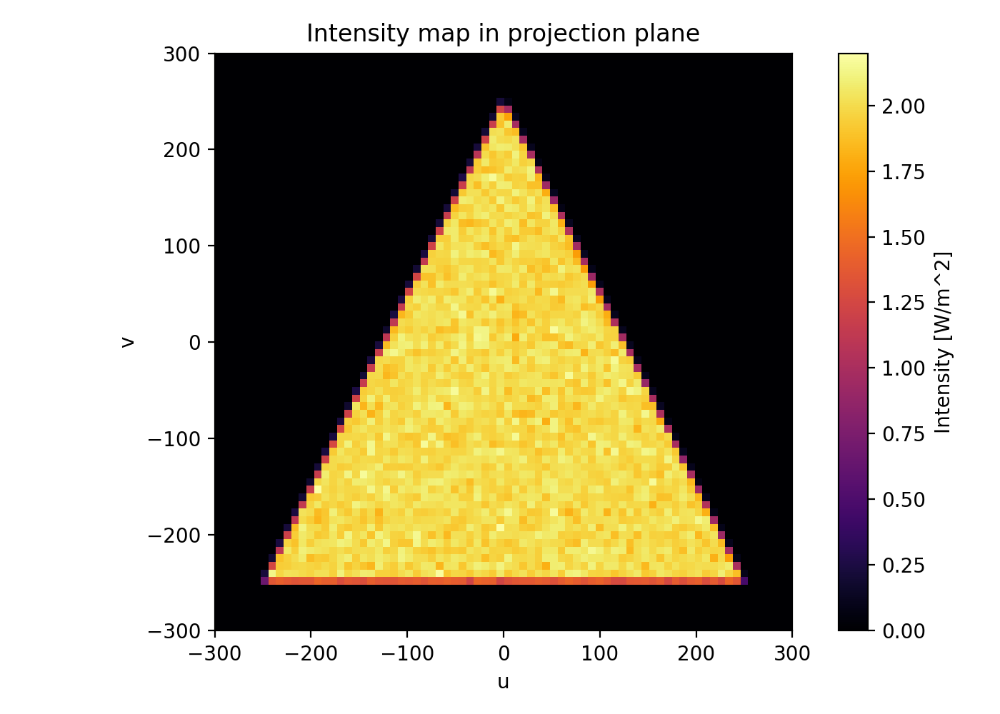

2. Pixelated center activation, flat intensity (`pixelated`, `center`, `flat`, `collimated`, mask: `triangle`)

  Config: [triangle_pixelated_flat.toml](examples/raygen/triangle_pixelated_flat.toml)

  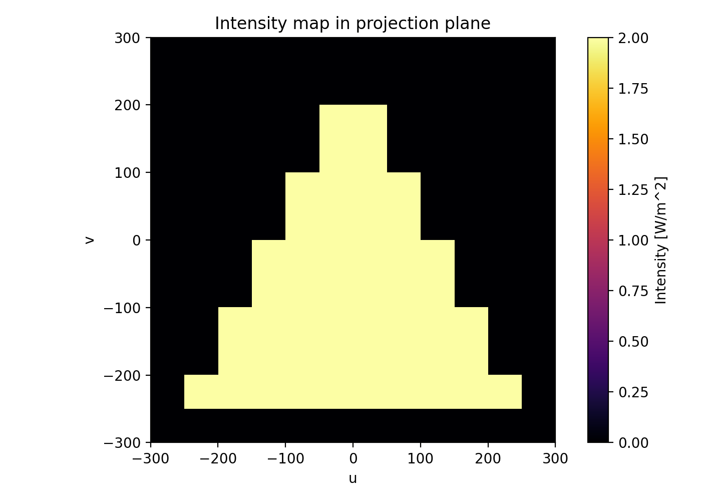

3. Pixelated antialiased activation, flat intensity (`pixelated`, `antialiased`, `flat`, `collimated`, mask: `circle`)

  Config: [circle_antialiased_flat.toml](examples/raygen/circle_antialiased_flat.toml)

  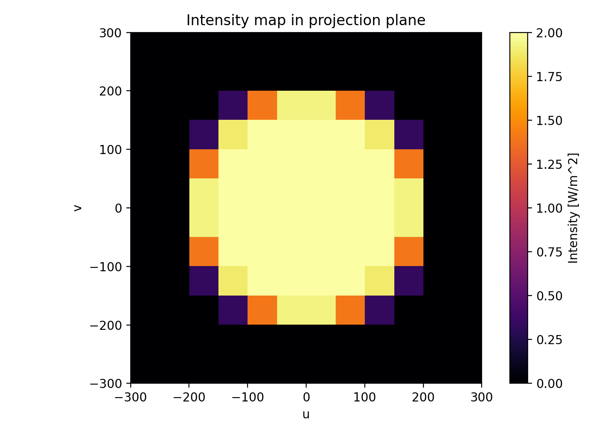

4. Pixelated center activation, flat intensity, focused (`pixelated`, `center`, `flat`, `focused`, mask: `annulus`)

  Config: [annulus_pixelated_focused.toml](examples/raygen/annulus_pixelated_focused.toml)

  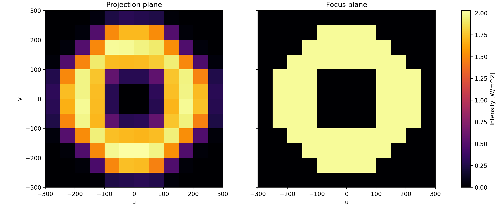

5. Pixelated center activation, Gaussian intensity (`pixelated`, `center`, `gaussian`, `collimated`, mask: `rectangle`)

  Config: [rectangle_gaussian_pixelated.toml](examples/raygen/rectangle_gaussian_pixelated.toml)

  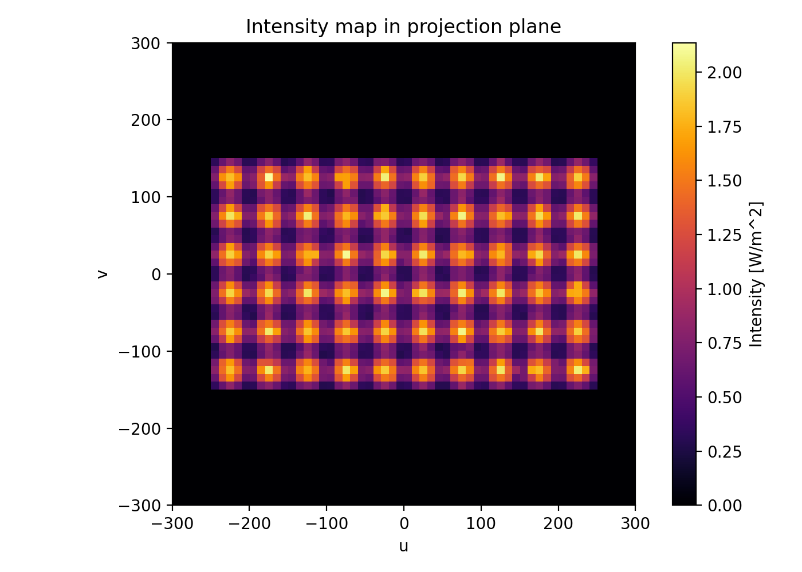

6. Pixelated antialiased activation, Gaussian intensity (`pixelated`, `antialiased`, `gaussian`, `collimated`, mask: `triangle`)

  Config: [triangle_gaussian_antialiased.toml](examples/raygen/triangle_gaussian_antialiased.toml)

  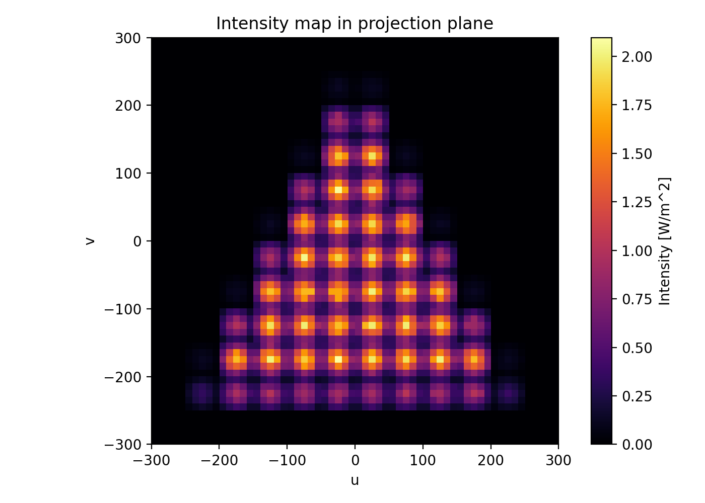

7. Pixelated center activation, Gaussian intensity, focused (`pixelated`, `center`, `gaussian`, `focused`, mask: `circle`)

  Config: [circle_gaussian_focused.toml](examples/raygen/circle_gaussian_focused.toml)

  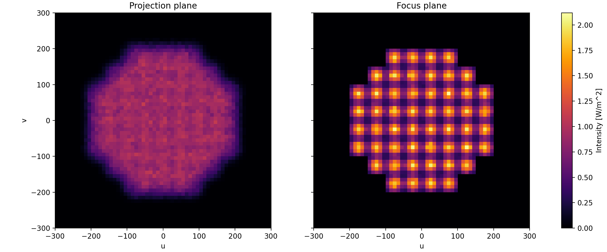

8. Pixelated antialiased activation, Gaussian intensity, focused (`pixelated`, `antialiased`, `gaussian`, `focused`, mask: `annulus`)

  Config: [annulus_gaussian_antialiased_focused.toml](examples/raygen/annulus_gaussian_antialiased_focused.toml)

  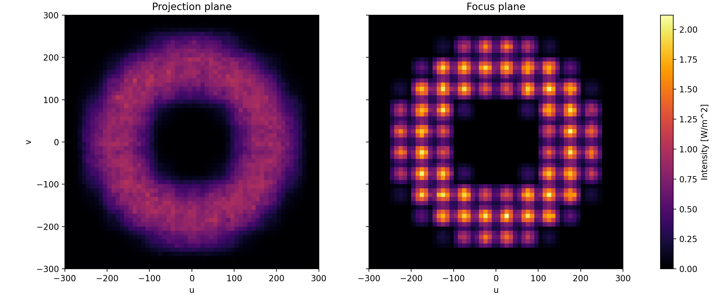

9. Averaging case with projector jitter (`pixelated`, `antialiased`, `gaussian`, `focused`, mask: `annulus`, jitter: 5 pixels, samples: 20)

  Config: [annulus_gaussian_antialiased_focused_avg_jitter2px.toml](examples/raygen/annulus_gaussian_antialiased_focused_avg_jitter2px.toml)

  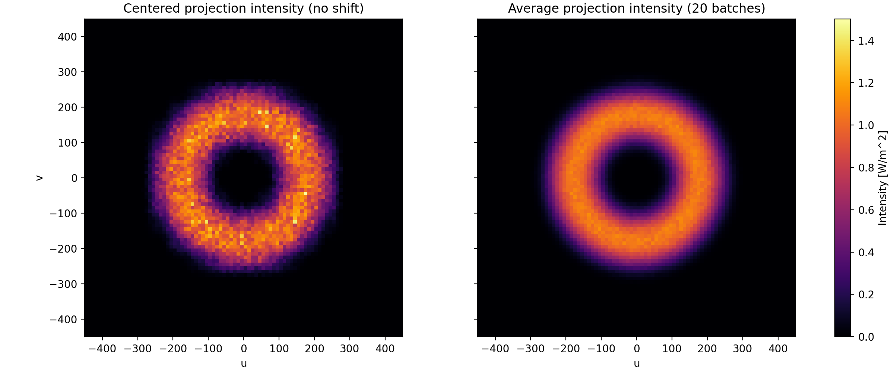

  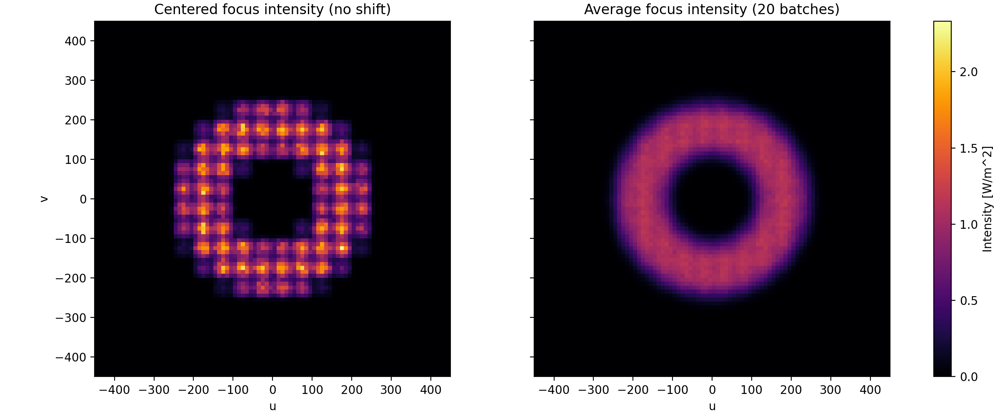

10. Averaging case with projector jitter, no antialiasing (`pixelated`, `center`, `gaussian`, `focused`, mask: `annulus`, jitter: 5 pixels, samples: 20)

  Config: [annulus_gaussian_center_focused_avg_jitter2px.toml](examples/raygen/annulus_gaussian_center_focused_avg_jitter2px.toml)

  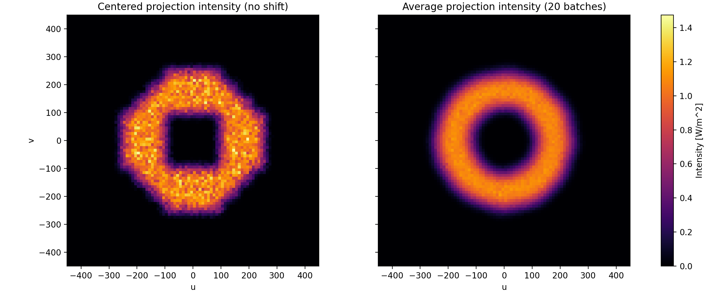

  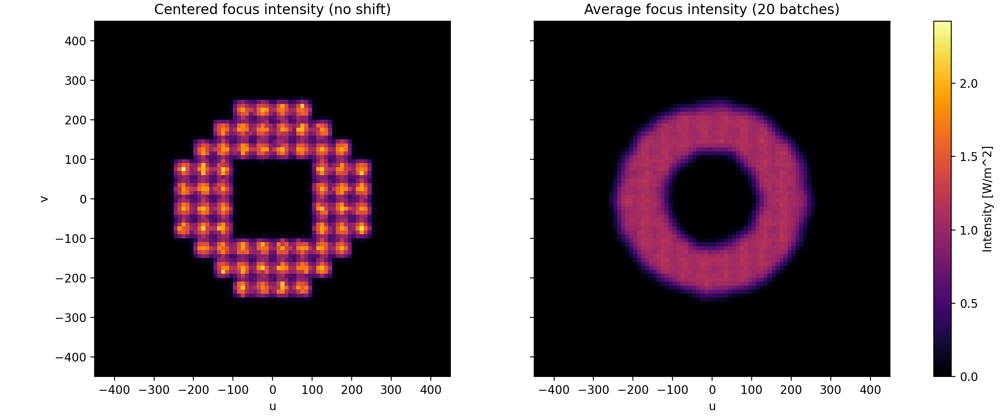

## Intensity-map binning

- Pixelated + `flat`: default 1 bin per pixel (bin size = pixel pitch).
- Pixelated + `gaussian`: default `bins_per_pixel = [5, 5]` (5x5 bins per pixel).
- Continuous: auto bin size from ray density over mask area.

## Notes

- Image-mask import is intentionally not implemented yet.
- Relative paths in TOML are resolved from the TOML file location.
